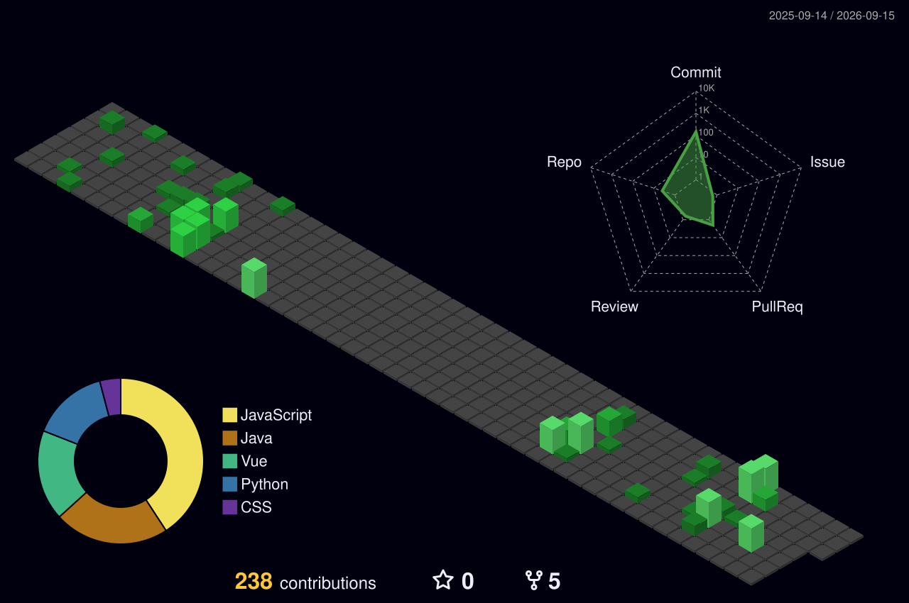

  
 

### 🌿 Tech Stack 🌿

##### 🐤 Platforms & Languages 🐤

 

##### 🔧 Tools 🔧

##### 🐣 Contact 🐣

### 📝 Latest 3 Blog Posts 📝
<!-- BLOG-POST-LIST:START -->
- [[OS] Mutex, Semaphore, Deadlock](https://ytnwjd.tistory.com/entry/OS-Mutex-Semaphore-Deadlock)
- [[OS] Process와 Thread](https://ytnwjd.tistory.com/entry/OS-Process%EC%99%80-Thread)
- [[OS] 운영체제 개요 - 역할, System Call](https://ytnwjd.tistory.com/entry/OS-%EC%9A%B4%EC%98%81%EC%B2%B4%EC%A0%9C-%EA%B0%9C%EC%9A%94-%EC%97%AD%ED%95%A0-System-Call)
<!-- BLOG-POST-LIST:END -->
 

 

  
### 🍀 Github Stats 🍀
  

 

### 🧱 Contribution Graph 🧱

